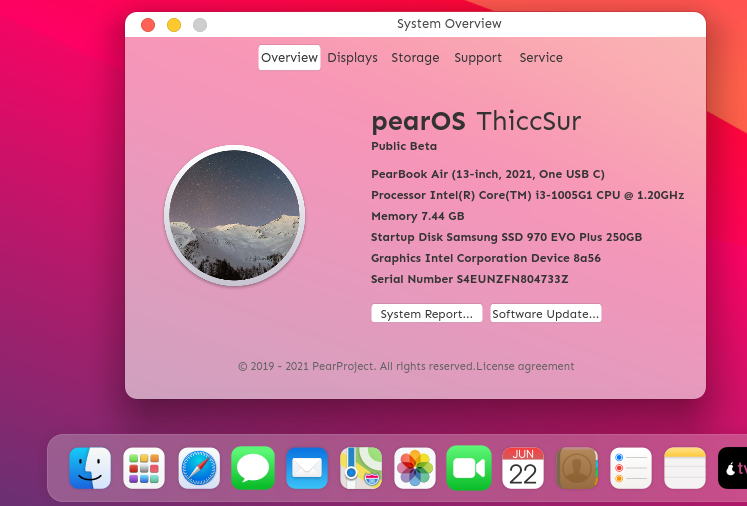
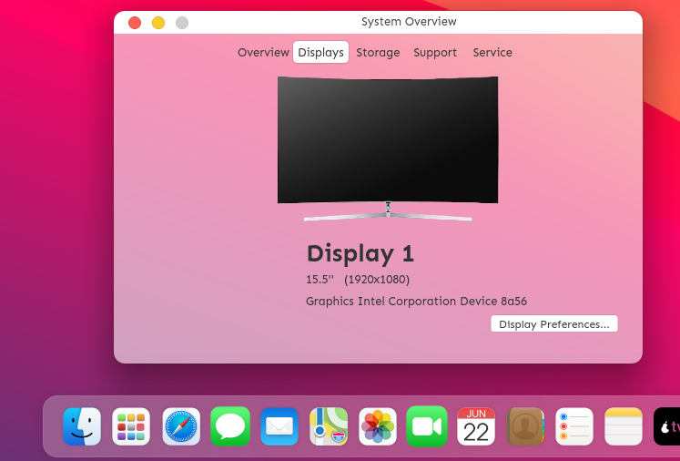
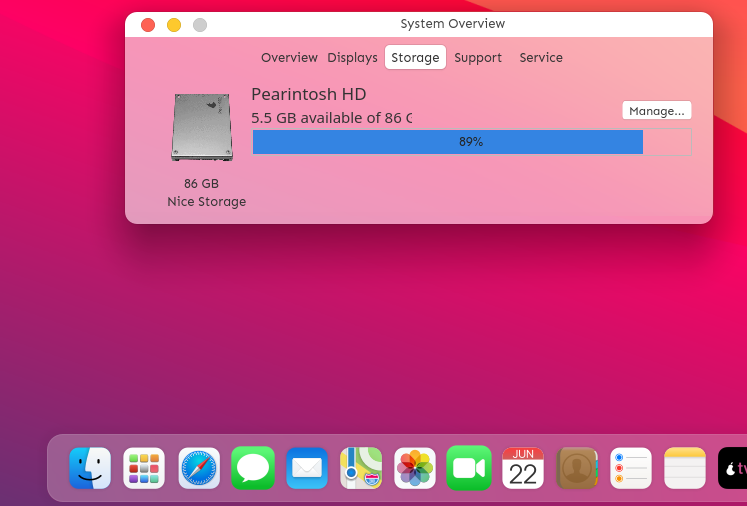
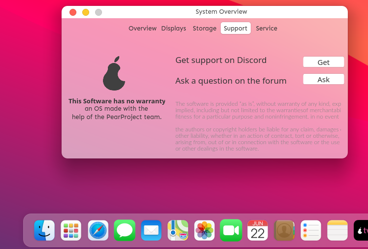
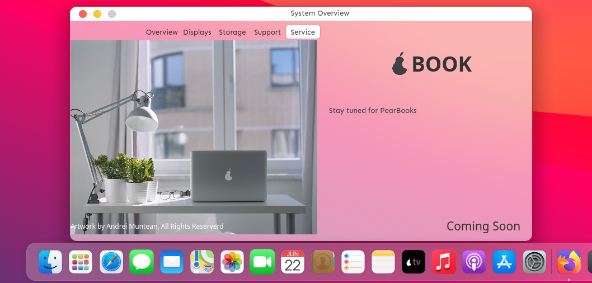

# System Overview app for pearOS
This app is made to look and feel like the macOS system-overview app :))

## Screenshots :)

Main page


Display info


Storage info


Support page


Service page

## Dependencies

   - install gambas3 package
   ```sh
   $ sudo apt-get install gambas3 -y
   ```
   - get the [pearOS package](https://github.com/Pear-Project/pearOS-package)
   - create a directory `sudo mkdir -p /usr/share/extras`
   - move `release_logo.png` in `/usr/share/extras`
   - move `inches.py` in `/usr/share/extras`
   - ready to install

## Installation steps
 - From Source:

   - clone the project
   ```sh
   git clone https://github.com/alxb421/system-overview
   ```
   - Open gambas3 application (from terminal `$ gambas3`, or from application dashboard, search for gambas3)
   - Click `Open`
   - Navigate to cloned folder, and open the project
   - Click on `Project` > `Make` > `executable`
   - copy the new executable in the `/usr/bin` folder of your Linux machine
   ```sh
   $ sudo mv <path to your system-overview.gambas> /usr/bin/sysoverview
   ```
   - Enjoy :p

 - From Package:
   - Download the .deb package from `Releases` tab here, in GitHub
   - Install using gdebi/ dpkg
   ```sh
   $ sudo dpkg -i <path to downloaded deb file, or drag and drop>
   ```
   
   ## Usage
   Open a terminal and type `sysoverview` :)
